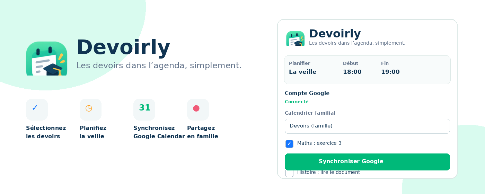
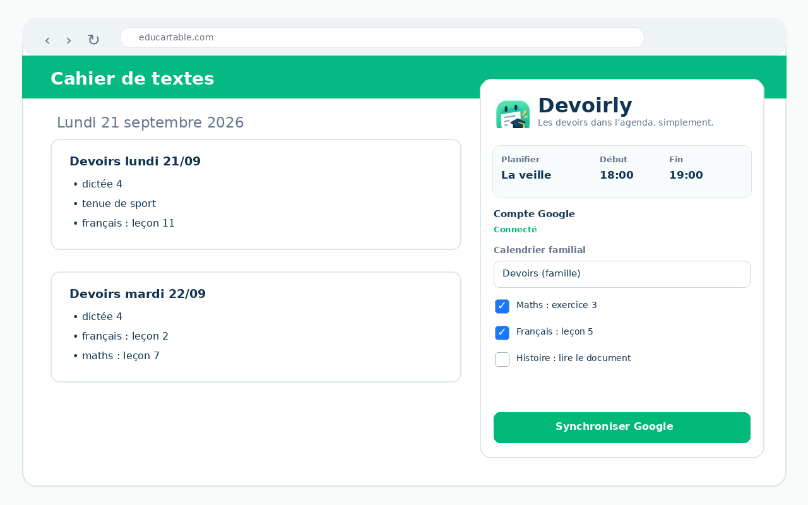

<div align="center">


# Devoirly

### Les devoirs dans l’agenda, simplement.

Transformez les devoirs affichés dans **Educartable** en événements **Google Calendar**, avec sélection ligne par ligne, planification la veille et synchronisation dans un calendrier familial partagé.

<br>



</div>

---

## Pourquoi Devoirly ?

Les devoirs sont souvent indiqués pour **le jour où ils doivent être prêts**, alors que les familles doivent s’organiser avant.

Devoirly facilite ce passage entre le cahier de textes et l’agenda familial :

- 📚 récupère les devoirs affichés dans Educartable ;
- ☑️ permet de sélectionner ou désélectionner chaque ligne ;
- 🧩 convient aux classes à double niveau ;
- ⏰ planifie les devoirs **la veille**, par défaut de **18h à 19h** ;
- 📅 synchronise directement avec **Google Calendar** ;
- 👨‍👩‍👧 fonctionne avec un calendrier familial partagé ;
- 🔄 met à jour l’événement existant au lieu de créer des doublons.

---

## Aperçu

<div align="center">



</div>

---

## Comment ça marche ?

1. Ouvrez **Educartable** et rendez-vous sur la page **Devoirs**.
2. Ouvrez l’extension **Devoirly**.
3. Connectez votre compte Google.
4. Choisissez le calendrier à utiliser.
5. Sélectionnez uniquement les devoirs utiles.
6. Cliquez sur **Synchroniser Google**.

### Exemple

Si Educartable indique un devoir pour **mardi**, Devoirly peut créer l’événement :

> **Lundi — 18h00 à 19h00**  
> 📚 Devoirs pour mardi  
> • dictée 4  
> • français : leçon 11  
> • maths : leçon 7  

Si vous modifiez ensuite votre sélection, Devoirly met à jour **le même événement**.

---

## Calendrier familial partagé

Devoirly peut écrire dans tout calendrier Google pour lequel vous avez les droits nécessaires.

Une configuration pratique consiste à créer un calendrier :

> **Devoirs**

puis à le partager avec l’autre parent.

Les deux parents voient alors automatiquement les mêmes événements dans Google Calendar.

---

## Confidentialité

Devoirly est conçu pour limiter les accès au strict nécessaire :

- les devoirs sont lus depuis la page Educartable déjà ouverte ;
- Devoirly ne demande pas votre mot de passe Educartable ;
- les préférences sont enregistrées localement dans Chrome ;
- les événements sélectionnés sont envoyés à Google Calendar uniquement lorsque vous lancez une synchronisation ;
- Devoirly ne vend pas les données utilisateur ;
- aucune donnée n’est utilisée à des fins publicitaires.

👉 Consultez la [politique de confidentialité](PRIVACY.md).

---

## Permissions

| Permission | Utilisation |
|---|---|
| `storage` | Enregistrer localement les réglages Devoirly |
| `identity` | Connexion OAuth au compte Google |
| Accès Educartable | Lire les devoirs affichés sur la page |
| Google Calendar | Lire la liste des calendriers et synchroniser les événements |

---

## Installation en développement

Clonez le dépôt :

```bash
git clone https://github.com/VOTRE-UTILISATEUR/devoirly.git
cd devoirly
```

Puis :

1. Ouvrez `chrome://extensions`
2. Activez **Mode développeur**
3. Cliquez sur **Charger l’extension non empaquetée**
4. Sélectionnez le dossier du projet
5. Rechargez l’onglet Educartable après chaque rechargement de l’extension

> ℹ️ Pour OAuth en développement local, l’ID Chrome de l’extension peut différer de celui du Chrome Web Store. Un client OAuth de développement séparé peut donc être nécessaire.

---

## Google OAuth

Devoirly utilise Google OAuth 2.0 et Google Calendar API.

La version destinée au Chrome Web Store doit utiliser un Client ID OAuth de type **Extension Chrome** associé à l’ID définitif de l’extension publiée.

Ne publiez jamais dans le dépôt :

- `client_secret`
- token OAuth
- mot de passe
- clé privée

Le **Client ID OAuth** d’une extension Chrome est, lui, public par conception.

---

## Version actuelle

### Devoirly 3.3

Principales améliorations :

- synchronisation Google Calendar stable ;
- mise à jour d’un événement existant ;
- réduction des doublons ;
- sélection ligne par ligne ;
- OAuth Google ;
- calendrier partagé ;
- planification configurable.

---

## Roadmap

Quelques pistes pour les prochaines versions :

- détection automatique des changements Educartable ;
- meilleure gestion des devoirs supprimés ou déplacés ;
- support d’autres plateformes scolaires ;
- options avancées de titre et de description ;
- publication et mises à jour via le Chrome Web Store.

---

## Chrome Web Store

Devoirly est actuellement en préparation pour sa première publication publique.

<!-- Une fois publiée, remplacer la ligne ci-dessous par le lien officiel du Chrome Web Store. -->

**Bientôt disponible sur le Chrome Web Store.**

---

## Contributions

Les retours, rapports de bugs et idées d’amélioration sont les bienvenus via les **Issues GitHub**.

---

## Indépendance

Devoirly est un projet indépendant. Il n’est ni édité, ni sponsorisé, ni affilié à **Educartable**, **Edumoov** ou **Google**.

---

<div align="center">

**Devoirly**  
*Les devoirs dans l’agenda, simplement.*

</div>
